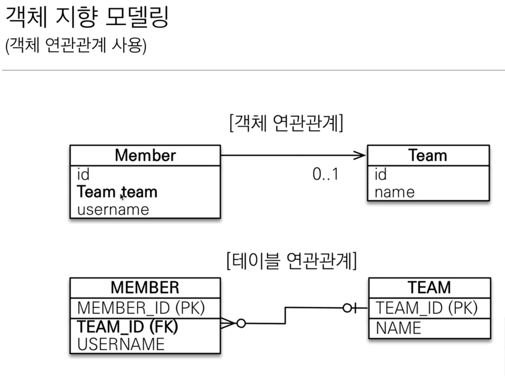
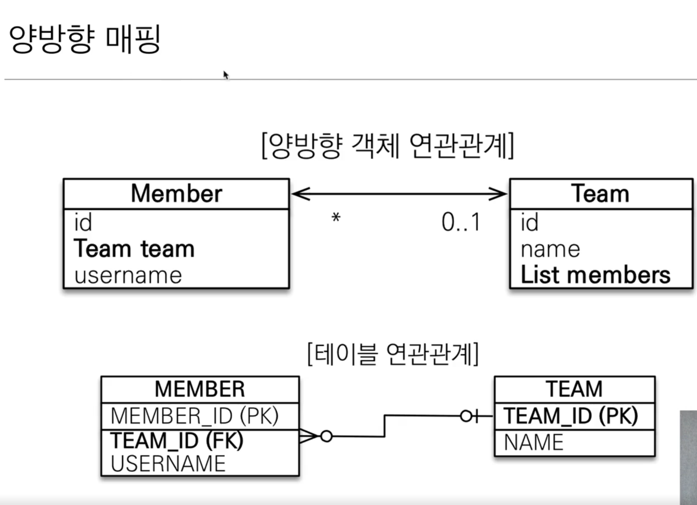
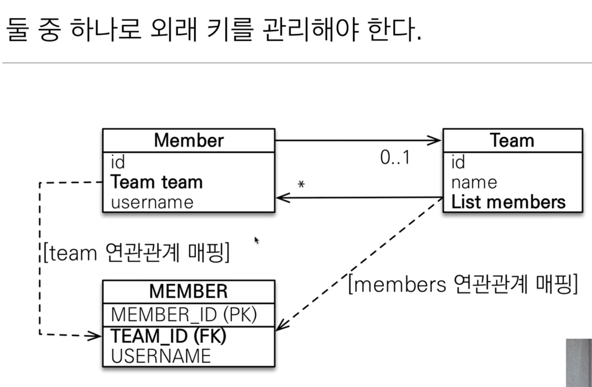

# 연관관계 매핑 가치

### 목표
- **객체와 테이블 연관관계의 차이를 이해**
- **객체의 참조와 테이블의 외래 키를 맵핑
- 용어 이해
  - **방향**(Direction): 단방향, 양방향
  - **다중성**(Multiplicity): 다대일(N:1), 일대다(1:N), 일대일(1:1), 다대다(N:M) 이해

- **연관관계의 주인**(Owner): 객체 양방향 연관관계는 관리주인이 필요

### 객체를 테이블에 맞추어 데이터 중심으로 모델링하면, 협력 관계를 만들 수 없다.

- **테이블은 외래 키로 조인**을 사용해서 연관된 테이블을 찾는다.

- **객체는 참조** 사용해서 연관된 객체를 찾는다.

- 테이블과 객체 사이에는 이런 큰 간격이 있다.

## 단반향 연관관계

## 양방향 연관관계와 연관관계의 주인

### 연관관계의 주인과 mappedBy

- mappedBy = JPA의 멘탈붕괴 난이도

- mappedBy는 처음에는 이해하기 어렵다.

- 객체와 테이블간에 연관관계를 맺는 차이를 이해해야 한다.

### 테이블의 양방향 연관관계

- 테이블은 ** 외래 키 하나**로 두 테이블의 연관관계를 관리

- MEMBER.TEAM_ID 외래 키 하나로 양방향 연관관계 가짐 
  (양쪽으로 조인할 수 있다.)

 

### SELECT *  FROM MEMBER M JOIN TEAM T ON M.TEAM_ID = T.TEAM_ID

 

### SELECT *  FROM  TEAM T JOIN MEMBER M ON T.TEAM_ID = M.TEAM_ID

 

 
 

### 연관관계의 주인(Owner)

#### **양방향 매핑 규칙**

- 객체의 두 관계중 하나를 연관관계의 주인으로 지정

- **연관관계의 주인만이 외래 키를 관리(등록, 수정)**

- **주인이 아닌 쪽은 읽기만 가능**

- 주인은 mappedBy 속성 사용 X

- 주인이 아니면 mappedBy 속성으로 주인 지정

