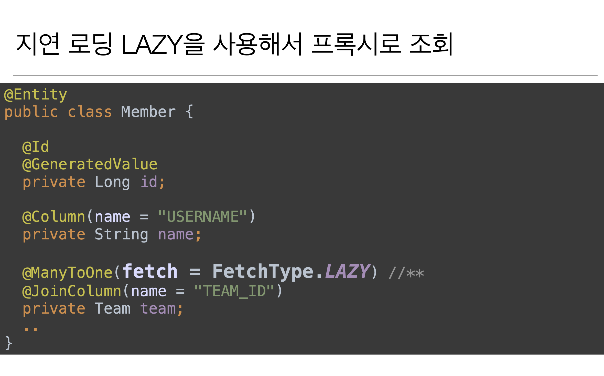
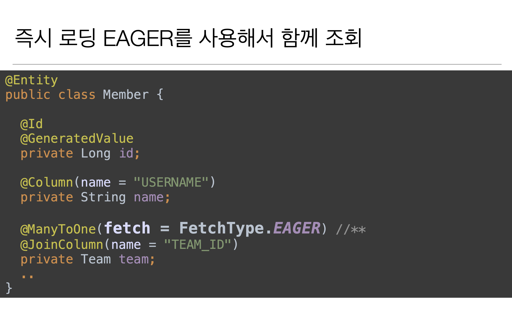

# 섹션 8. 프록시와 연관관계 관리

## 즉시 로딩과 지연 로딩

### 지연 로딩

### 즉시 로딩

### 프록시와 즉시로딩 주의

- **가급적 지연 로딩만 사용(특히 실무에서)**

- 즉시 로딩을 적용하면 예상하지 못한 SQL이 발생

- **즉시 로딩은 JPQL에서 N+1 문제를 일으킨다.**

- **@ManyToOne, @OneToOne은 기본이 즉시 로딩임 -> LAZY로 항상 설정해야됨**

- @OneToMany, @ManayToMany는 기본이 지연 로딩

### 지연 로딩 활용 - 실무

- 모든 연관관계에 지연 로딩을 사용해라!

- 실무에서 즉시 로딩을 사용하지 마라!

- JPQL fetch 조인이나, 엔티티 그래프 기능을 사용해라!

- 즉시 로딩은 상상하지 못한 쿼리가 나간다.

